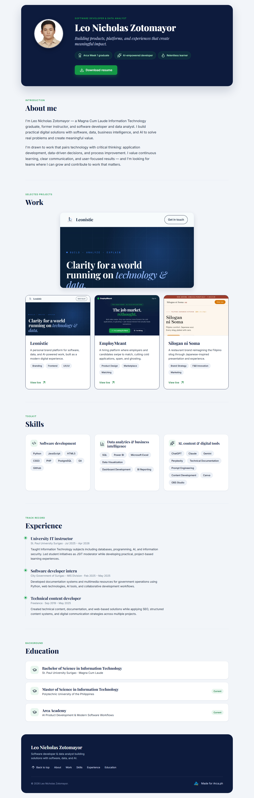
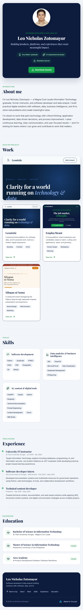
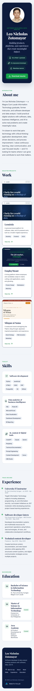

# Portfolio QA Report

- **Target:** http://localhost:8000/
- **Engine:** chromium
- **Summary:** 12 passed · 0 failed · 0 warnings (of 12 checks)

| Check | Result | Detail |
| --- | :---: | --- |
| 1. Page loads | ✅ PASS | http://localhost:8000/ → HTTP 200 |
| 2. Title correct | ✅ PASS | title="Leo Nicholas Zotomayor \| Portfolio" |
| 2. Meta description set | ✅ PASS | len=76/160 — "Building products, platforms, and experiences that create meaningful impact." |
| 3. Profile photo loads | ✅ PASS | naturalWidth 600px |
| 4. Resume is a real PDF | ✅ PASS | http://localhost:8000/assets/resume.pdf → HTTP 200 (application/pdf), downloaded as "leo-zotomayor-resume.pdf" |
| 5. "View live" links return 200 | ✅ PASS | https://leonistic.vercel.app/ → 200; https://employmeant.vercel.app/ → 200; https://silogan-ni-soma.vercel.app/ → 200 |
| 6. Social links | ✅ PASS | None present — correct (portfolio has no contact/social section by design) |
| 7. mailto: link | ✅ PASS | None present — correct (no contact section by design) |
| 8. Desktop screenshot (1440x900) | ✅ PASS | screenshots/qa-desktop-1440x900.png |
| 8. Tablet screenshot (768x1024) | ✅ PASS | screenshots/qa-tablet-768x1024.png |
| 8. Mobile screenshot (375x667) | ✅ PASS | screenshots/qa-mobile-375x667.png |
| 9. No horizontal scroll (mobile) | ✅ PASS | scrollWidth 375 vs innerWidth 375 |

## Screenshots
### Desktop (1440×900)

### Tablet (768×1024)

### Mobile (375×667)

> Checks 6 & 7 verify correct **absence** — this portfolio intentionally has no contact section, social links, or mailto: link.
